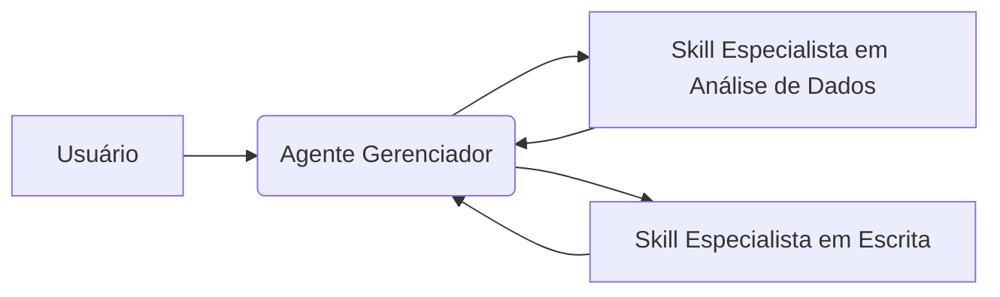

# Projetando Skills para Agentes: Guia de Engenharia

Este guia detalha arquiteturas de nível de produção para Agent Skills — conjuntos modulares e versionados de instruções, metadados e recursos projetados para agentes autônomos.

---

# 1. O que é uma Skill

Uma skill operacional é um recurso baseado em sistema de arquivos que estende a funcionalidade de um agente por meio de divulgação progressiva de contexto. Isso evita prompts de sistema monolíticos, carregando contexto apenas quando necessário.

## Exemplo de Produção (`SKILL.md`)

```yaml
---
name: data-validator
description: Valida payloads JSON usando schemas internos. Acione ao processar respostas brutas de APIs.
version: 1.2.0
---

# Skill de Validação de Dados
1. Leia o schema em `./resources/schema.json`
2. Execute `./scripts/validate.py` no payload de entrada.
3. Retorne logs estruturados de erro ou um token de sucesso.
```

---

# 2. Princípios de Design de Skills

| Princípio | O que significa | Por que é importante | Bom exemplo | Modo de falha |
|---|---|---|---|---|
| **Responsabilidade Única** | Cada skill deve ter apenas uma responsabilidade clara. | Simplifica testes e depuração. | Uma skill `pdf-extractor` lida apenas com extração de texto e tabelas. | Uma skill `document-pro` que faz OCR, tradução e SEO ao mesmo tempo. |
| **Contratos Explícitos** | Entradas e saídas devem seguir formatos bem definidos. | Garante entradas e saídas determinísticas para orquestração. | Uso de schemas JSON rígidos para todas as entradas das ferramentas. | Passar blobs de texto não estruturados entre agentes. |
| **Minimização de Contexto** | A skill deve carregar apenas o contexto necessário para executar a tarefa. | Reduz custo de tokens e evita problemas de “lost in the middle”. | Carregar apenas metadados de Nível 1 até que a skill seja chamada explicitamente. | Concatenar todas as instruções em um único prompt de 10k tokens. |
| **Idempotência** | Executar a mesma skill várias vezes deve gerar o mesmo resultado sem efeitos colaterais. | Evita efeitos colaterais durante tentativas de repetição. | Uma skill `fetch_profile` retorna dados sem alterar estado. | Uma skill `log_transaction` adiciona uma nova linha a cada execução. |

---

# 3. Anatomia de uma Skill em Produção

## Especificação Técnica

- **Trigger:** Definido na descrição YAML; usado pelo LLM para decidir relevância (Nível 1).
- **Entradas:** Definidas via JSON Schema/MCP tool definitions.
- **Janela de Contexto:** Controlada rigidamente via carregamento hierárquico (L1 Metadata → L2 Instructions → L3 Resources).
- **Permissões de Ferramentas:** Restritas ao ambiente específico da skill (ex.: shell local vs. hospedado).
- **Validação:** Executada pelo script da skill antes de retornar para o agente.

### O que significam L1, L2 e L3?

Os níveis L1, L2 e L3 representam camadas de contexto dentro de uma única skill, e não tipos diferentes de skills.

- **L1 (Metadata):** Informações curtas usadas pelo agente para decidir se a skill é relevante para a tarefa.
- **L2 (Instructions):** Instruções detalhadas sobre como a skill deve executar a tarefa.
- **L3 (Resources):** Arquivos e recursos adicionais utilizados pela skill, como documentos, schemas, exemplos ou guias internos.

Esse modelo de carregamento progressivo ajuda a reduzir consumo de contexto e melhora a capacidade do agente de selecionar apenas as informações necessárias em cada etapa.

---

# 4. Padrões de Composição

## Planner/Executor

O padrão Manager-Worker: um agente central decompõe tarefas e as delega para agentes especialistas atuando como ferramentas.



## Trade-offs Multiagente

- **Agente Único:** Menor overhead, porém mais sujeito a gargalos.
- **Descentralizado:** Alta tolerância a falhas, mas difícil coordenação de estado global.

---

# 5. Engenharia de Contexto

- **Isolamento de Contexto:** Use uma área de trabalho temporária para raciocínios intermediários e mantenha a conversa principal limpa.
- **Limites de Recuperação:** Skills devem acessar apenas seu próprio diretório `./resources/` para evitar contaminação de contexto com dados irrelevantes.
- **Heurísticas de Compressão:** Scripts devem resumir saídas grandes (ex.: `Validação concluída em 500 linhas`) em vez de retornar dados brutos completos ao LLM.

---

# 6. Confiabilidade de Skills

- **Circuit Breakers:** Evite que uma skill continue executando após falhas repetidas em dependências externas.
- **Reflection Loops:** Faça a própria skill revisar sua saída antes de retornar a resposta final.
- **Escalonamento Humano:** Defina situações em que a skill deve interromper a execução e encaminhar a tarefa para um humano.

---

# 7. Observabilidade

- **Rastreamento:** Monitore como as skills são acionadas e encadeadas durante a execução de tarefas complexas.
- **Custo por Skill:** Acompanhe o consumo de tokens individualmente para identificar skills excessivamente caras ou ineficientes.

---

# 8. Anti-Padrões

- **God Skills:** Skills monolíticas que tentam fazer tudo ao mesmo tempo, causando altas taxas de falha e overflow de contexto.
- **Excesso de Skills:** Expor dezenas de skills ao mesmo tempo pode dificultar a seleção correta pelo agente.
- **Estado Mutável Oculto:** Armazenar lógica crítica em estados persistentes da skill que o agente não consegue enxergar ou raciocinar sobre.

---

# 9. Estudo de Caso: Agente de Pesquisa

## Estratégia em Grafo

1. **Search Skill** — Responsável por encontrar artigos revisados por pares.
2. **Synthesis Skill** — Responsável por agrupar descobertas por metodologia.
3. **Validator Skill** — Responsável por validar referências e estilo de citação.

## Confiabilidade

Utiliza um Critic Loop, no qual um segundo agente valida se cada afirmação da síntese possui uma fonte correspondente nos resultados da busca.

# Fontes

- https://developers.openai.com/api/docs/guides/tools-skills
- https://platform.claude.com/docs/en/agents-and-tools/agent-skills/overview
- https://developers.googleblog.com/developers-guide-to-building-adk-agents-with-skills/
